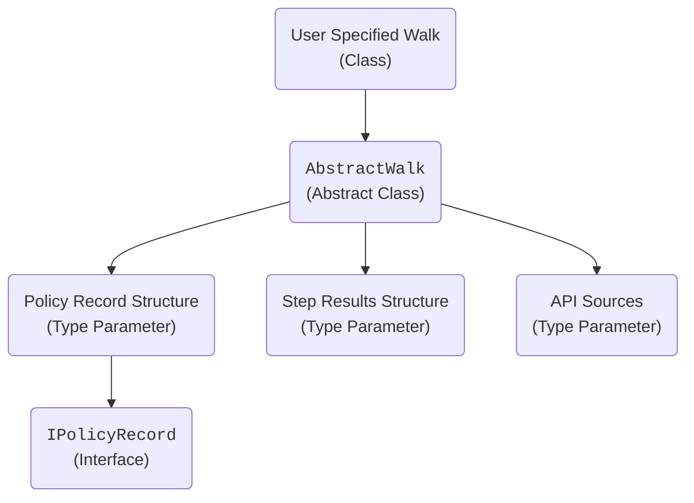

## Project `Implementations`

This project provides both:

* Building blocks that make it easier to define steps within a walk (and hence the walk itself).
* User implementations of specific walks.

### So... How is a walk specified?

Each walk is tightly coupled with the following:

* **Step results structure** - The metrics tracked for each step in the walk. For example, asset share, total premiums paid, claims values, etc...
* **Policy record structure** - The underlying properties for each policy record processed. For example, policy number and entry date.
* **API collection** - Represents a collection of the API end-points required for the walk.

The walk is made aware of the above via generic type parameters (which must therefore be known at compile-time).

Walks are defined within the context of a .NET class. In all cases, such classes must inherit from the `AbstractWalk` class which enforces the presence of certain steps along with the ability to "register" user supplied steps over and above those required below. This inheritance also notifies the machinery of:

The first three steps of a walk **must** be:

* Opening position.
* Opening re-run.
* Remove exited business.

The last two steps of a walk **must** be:

* Move to closing details for each record; specifically, those records in-force at **both** the opening **and** closing positions.
* Allow for new/reinstated business; also the closing step in the walk.

The user is free to supply as many additional (ie. **interior**) steps between those above as needed; this is discussed further in the following section.