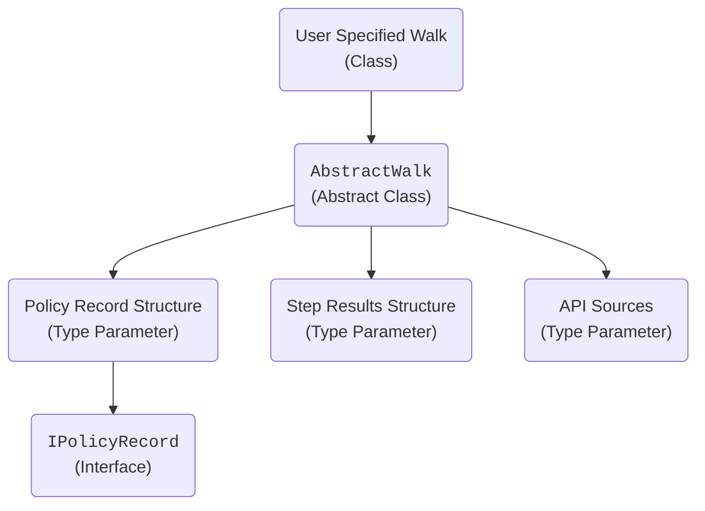

## Analysis Of Change Engine

### Some context...

Insurance companies (and likely other financial institutions) need to provide regular MI on the portfolio of business held on their books. This could be done at whatever frequency is desired, with values provided at the end of each respective **reporting period**.

The date at which these values are deemed to be effective is (not surprisingly) called the **effective date**.

In the case of an insurer, this regular MI could inlude (for example) the total asset share of this business which represents a fair value on which claim values can be based.

One simple approach is to simply calculate these metrics at the end of each reporting period. However, this doesn't contribute much information in terms of what has driven changes in these values nor provide enough information to give comfort that such movements are commensurate with expectations.

One solution to this is to perform an **analysis of change** (**AoC**). This approach aims to break down the change in values between reporting periods, for each record in the portfolio, by considering changes in the factors underlying those values.

In the case of life insurance business, one approach would be to calculate these values (such as asset shares) corresponding to each of the following steps, noting that each **step** in this **walk** is applied cumulatively.

* **Opening position** - Values from the end of the prior reporting period.
* **Opening re-run** - Re-run the latest logic using the data and parameters used at that time. In the absence of any changes in logic, this step provides a regression test on production logic.
* **Remove exited business** - Quantify the impact of any business that has left over the latest reporting period.
* **Data restatements** - Updating our opening data for any **unexpected** changes made over the reporting period. This would not typically include changes that would typically occur due to the passing of time (eg. date of last premium paid).
* **Opening restatements** - Recalculate opening values reflecting our latest view of parameters such as investment returns and deductions.
* **Data roll-forward** - Update our data for changes that typically occur due to the passing of time.
* **Change in effective date** - Move the date at which our values are effective from the end of the prior reporting period to that of the current reporting period.
* **Subsequent data and parameter changes** - Separate steps would be used to quantify the impact of (for example) premiums, deductions and investment returns.
* **New/reinstated business** - Allows us to quantify the impact of and new records in the portfolio. This is usually taken to be the closing step.

Depending on the set-up used, these values could be obtained (for example) from a spreadsheet based process or from one or more calls to an API. Although values would likely be aggregated in some way for reporting purposes, keeping the underlying record-level values better facilitates any analysis as may be required; this is particularly useful when investigating which records are driving unintuitive resuts for a given step in the walk.

### What are we trying to achieve here?

The purpose of this project is to provide a framework that allows for walks, such as that summarised above, to be coded in such a way as to be both transparent and also benefit from the advantages provided (e.g. type-safety) by a language such as F#.

Ultimately, user's should only care about **what** each step in the walk is doing.

The benefits offered include:

* Elegant way of specifying the logic of each step through a combination of user defined functions and code quotations.
* Making the minimum number of required calls to specified APIs. Either by re-using already provided values or by requesting as many outputs as possible in each request.

### So... How is a walk specified?

Each walk is tightly coupled with the following structures:

* Results tracked for each step in the walk (**step results**). For example, asset share, total premiums paid, claims values, etc...
* Policy records. For example, policy number, entry date, etc...
* Menu of API calls available.

All of these aspects must be strongly-typed and hence known at compile time.

```mermaid
---
config:
  theme: mc
  look: classic
  layout: dagre
---
flowchart TD
    A["User Specified Walk<br>(Class)"] --> B["<tt>AbstractWalk</tt><br>(Abstract Class)"]
    C["Policy Record Structure<br>(Type Parameter)"] --> F["<tt>IPolicyRecord</tt><br>(Interface)"]
    B --> C & D["Step Results Structure<br>(Type Parameter)"]
    B --> E["API Sources<br>(Type Parameter)"]
    A@{ shape: rounded}
    B@{ shape: rounded}
    C@{ shape: rounded}
    F@{ shape: rounded}
    D@{ shape: rounded}
    E@{ shape: rounded}
```

Walks are defined within the context of a .NET class. In all cases, such classes must inherit from the `AbstractWalk` class which enforces the presence of certain steps along with the ability to "register" user supplied steps over and above those required below. This inheritance also notifies the machinery of:

The first three steps of a walk **must** be:

* Opening position.
* Opening re-run.
* Remove exited business.

The last two steps of a walk **must** be:

* Move to closing details for each record; specifically, those records in-force at **both** the opening **and** closing positions.
* Allow for new/reinstated business; also the closing step in the walk.

The user is free to supply as many additional (i.e. **interior**) steps between those above as needed; this is discussed further in the following section.

### What about the steps themselves?

Although there is no limit to the number of steps in the walk, there _is_ a finite number of step **types** that can appear. Some of these can only be used at specific points (eg. the 'Remove exited business' step seen below). It is these step types that indicate to the machinery what type of action needs to be taken.

All steps implement the `IStepHeader` interface which requires the following information to be made available:

| **Member Name** | **.NET Type** | Comments |
| :-------------: | :-----------: | :------- |
| `Uid` | `System.Guid` | Duplicate `Uid`s within a walk a not permitted. |
| `Title` | `System.String` | |
| `Description` | `System.String` | |

Outside of this, different step types require different information in order to function, as we will see below.

For the **required** steps, we have:

| **Step** | **`AbstractWalk` Member** | **.NET Type** | **Information Required** |
| :------: | :-----------------------: | :-----------: | :----------------------- |
| Opening | `Opening` | `OpeningStep` | None. |
| Opening re-run | `OpeningRegression` | `SourceChangeStep` | See 'Source Steps' below. |
| Remove exited business | `RemoveExitedRecords` | `RemoveExitedRecordsStep` | None. |
| Move to closing existing data | `MoveToClosingExistingData` | `ClosingExistingDataStep` | Optional validation logic. |
| Add new records | `AddNewRecords` | `AddNewRecordsStep` | Optional validation logic. |

For user supplied interior steps, the only choices are:

| **.NET Type** | **Information Required** |
| :-----------: | :----------------------- |
| `SourceChangeStep` | See 'Source Steps' below. |
| `DataChangeStep` | See 'Data Change Steps' below. |

Ultimately, each step/step type indicates one of the following:

* The opening step in the walk.
* Change to the current policy record being processed.
* Change in how the step result metrics are calculated.
  * This could include changes in metrics 