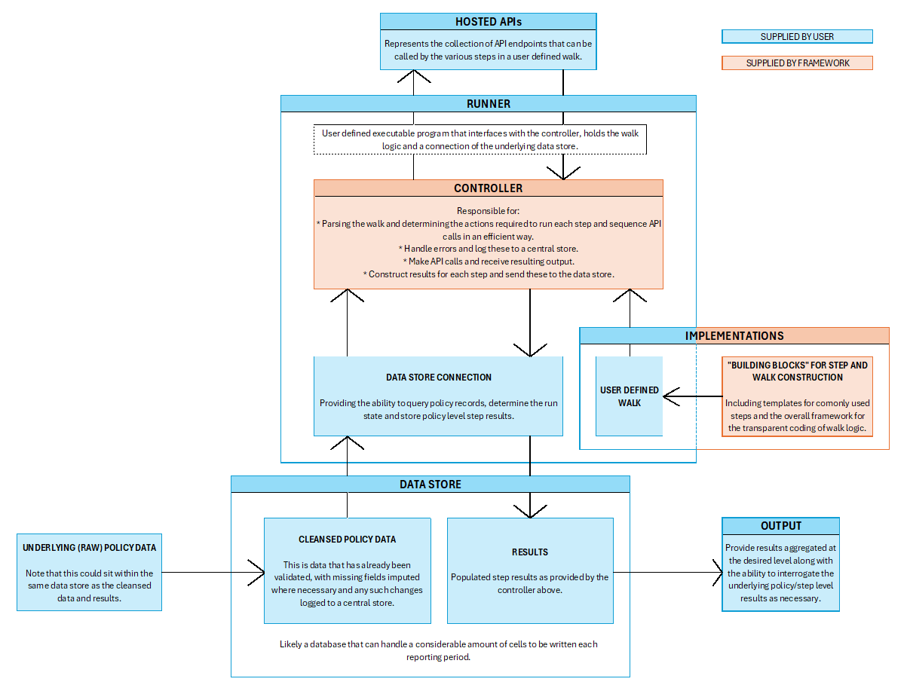

## Analysis Of Change Engine

### Some context...

Insurance companies (and likely other financial institutions) need to provide regular MI on the portfolio of business held on their books. This could be done at whatever frequency is desired, with values provided at the end of each respective **reporting period**.

The date at which these values are deemed to be effective is (not surprisingly) called the **effective date**.

In the case of an insurer, this regular MI could inlude (for example) the total asset share of this business which represents a fair value on which claim values can be based. Such values of interest will be referred to as **metrics**.

One simple approach is to simply calculate these metrics at the end of each reporting period. However, this doesn't contribute much information in terms of what has driven changes in these values nor provide enough information to give comfort that such movements are commensurate with expectations.

One solution to this is to perform an **analysis of change** (**AoC**). This approach aims to break down the change in values between the start and end of a reporting period, for each record in the portfolio, by considering changes in the factors underlying those values.

By aggregating results across multiple (and consecutive) reporting periods, we can form a view as to what has driven movements over a longer period of time. For example, by combining results from multiple monthly analyses, it is (relatively) trivial to get the correspoding view for an entire year.

The results at the end of a reporting period will be used as the results at the start of the next reporting period. The results at the start and end of a given reporting period are referred to as the **opening position** and **closing position** respectively.

Usually, reporting periods are back-to-back and of the same length each time. The period length chosen _should_ ideally reflect the frequency at which the underlying drivers themselves change. Where (for example) investment returns are being updated monthly, it _might_ be reasonable to use a reporting period of one month; the AoC process referred to here would therefore be run each and every month. Aligning the reporting period in this way means that unexpected movements (potentially errors) are spotted earlier and can (hopefullt) be resolved sooner.

In the case of life insurance business, one approach would be to calculate these metrics (such as asset shares) corresponding to each of the following steps (where relevant), noting that each **step** in this **walk** is applied cumulatively.

* **Opening position** - Values from the end of the prior reporting period.
* **Opening re-run** - Re-run the latest logic using the data and parameters used at that time. In the absence of any changes in logic, this step provides a regression test on production logic.
* **Remove exited business** - Quantify the impact of any business that has left over the latest reporting period.
* **Data restatements** - Updating our opening data for any **unexpected** changes made over the reporting period. This would not typically include changes that would typically occur due to the passing of time (eg. date of last premium paid).
* **Data roll-forward** - Update our data for changes outside of those above.
* **Change in effective date** - Move the date at which our values are effective from the end of the prior reporting period to that of the current reporting period.
* **Parameter changes** (including latest cashflows) - Separate steps would be used to quantify the impact of (for example) premiums, deductions and investment returns.
* **New/reinstated business** - Allows us to quantify the impact of and new records in the portfolio. This is usually taken to be the closing step.

Depending on the set-up used, these values could be obtained (for example) from a spreadsheet based process or from one or more calls to an API. Although values would likely be aggregated in some way for reporting purposes, keeping the underlying record-level values better facilitates any analysis as may be required; this is particularly useful when investigating which records are driving unintuitive resuts for a given step in the walk.

The visual below shows how reporting periods are 'stitched' together:

* The closing position for _Reporting Period 1_ becomes the opening position for _Reporting Period 2_, and so on.
* For policies which are in-force for both the opening and closing positions, results will be available for **all** steps in the walk.
* For policies which have exited at _some_ point (we don't necessarily care about exactly when) during the reporting period, results will not be available for the _Remove Exited Records_ step or beyond.
* For policies which have appeared at _some_ point (again, we don't care about exact timing) during the reporting period, results will only be available for the final _Add New Records_ step.

By executing the various steps within a walk, in the correct order, we can analyse the main drivers behind how metrics have changed between the opening and closing positions for a given reporting period.

### What are we trying to achieve here?

The purpose of this repository, including the various projects within, is to provide a framework that allows for walks (such as that summarised above) to be coded and run in such a way as to be both transparent and also benefit from the advantages provided by a funcitonal language such as F# and the .NET ecosystem as a whole.

Ideally:

* Users should only care about how each step in the walk is defined, and **not** how the machinery makes it happen.
* There should be a transparent way of specifying the logic of each step through a combination of user defined functions and code quotations.
* The number of API calls should be kept to a minimum. Either by re-using already provided values and/or by grouping requests together where possible.
* Walks should be easy to run and agnostic to certain aspects such as the underlying data-store used.

### So... What is provided?

The following projects are **core** to what we are trying to achieve here:

* [**`Core`**](/Core) - Provides definitions of common types used throughout the solution. It is not expected that users will need to directly reference this project.
* [**`Controller`**](/Controller) - Provides logic needed to convert a user supplied walk into actionable code (via runtime compilation) and execute it.

The following projects are specific to the walks (and hence likely the coresponding portfolio of business) that need to be run and the mechanisms needed to make that happen:

* [**`Walks`**](/Walks) - Definitions of the various user supplied walks, including bindings for any required API callcs.
* [**`Structures`**](/Structures) - Definitions of the various structures used within the user defined walks above. This would included any required definitions of policy data and step result metrics.
* [**`DataStore.Postgres`**](/DataStore.Postgres) - Provides an interface to an underlying data-store hosted on a Postgres database.
* [**`Runner`**](/Runner) - A user supplied executable that, by bringing together the various aspects above, will phyically run the walk.

A visual depiction of this can be found below:

